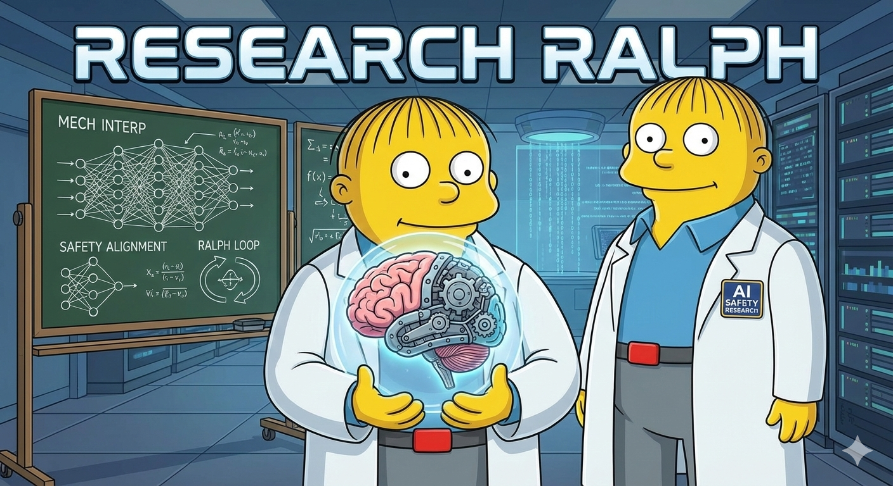

# researchRalph: Autonomous Research Agent for Probe Architecture Discovery

<p align="center">
  
</p>

<p align="center">
  <em>"Me fail alignment faking detection? That's unpossible!"</em> - researchRalph
</p>

---

## What Can researchRalph Investigate?

researchRalph excels at **systematic, hypothesis-driven exploration** of research questions. Here's what it can answer:

### Architecture Questions
| Question | How Ralph Answers |
|----------|-------------------|
| "What probe architecture works best?" | Iterative search: binary features → log transform → hidden layers → activations |
| "Is ReLU or ELU better?" | Controlled experiments comparing activation functions |
| "How many hidden units are enough?" | Ablation from 4 → 16 → 64 → 128 units |
| "Does attention pooling beat max pooling?" | Head-to-head comparison with same features |

### Feature Questions
| Question | How Ralph Answers |
|----------|-------------------|
| "Which features matter most?" | Drop-one ablation study ranking by AUROC delta |
| "Are hand-picked features better than random?" | Random baseline experiment (0.83 vs 0.51 AUROC) |
| "Should I use more L40 or L53 features?" | Per-layer performance analysis |
| "Which feature should I replace first?" | Ablation identifies lowest-importance features |

### Training Questions
| Question | How Ralph Answers |
|----------|-------------------|
| "What learning rate is optimal?" | Grid search or guided exploration |
| "Is weight decay helping or hurting?" | A/B comparison with/without regularization |
| "When to stop training?" | Early stopping experiments |

### Meta-Research Questions
| Question | How Ralph Answers |
|----------|-------------------|
| "Is grid search or iterative better?" | Compare sample efficiency (4 vs 94 experiments) |
| "Have I hit the architecture ceiling?" | Plateau detection after N experiments with <0.01 gain |
| "What should I try next?" | Hypothesis generation from prior results |

### Example Investigation: Architecture Discovery

```
Iteration 1: Binary features help ranking        → +0.07 AUROC
Iteration 2: Log transform restores calibration  → +0.02 AUROC
Iteration 3: ReLU hidden layer (dead neurons!)   → +0.00 AUROC
Iteration 4: ELU hidden layer                    → +0.05 AUROC
Result: 0.83 AUROC in 4 experiments (vs 94 for grid search)
```

### Example Investigation: Feature Ablation

```
Drop L40_F15484 (Future self)       → -0.080 AUROC ★★★ MOST IMPORTANT
Drop L53_F8003 (Training context)   → -0.053 AUROC
Drop L53_F4824 (Compliance)         → -0.048 AUROC
...
Drop L40_F8921 (Self-preservation)  → -0.015 AUROC ★ LEAST IMPORTANT
```

### What Ralph Does NOT Do Well

- **Open-ended exploration** - needs a specific research question
- **Novel algorithm invention** - explores within defined search space
- **Cross-domain transfer** - specialized for probe architecture research
- **Real-time adaptation** - batch iteration model, not online learning

---

## Architecture Diagram

```
┌─────────────────────────────────────────────────────────────────────────────┐
│                            researchRalph                                     │
├─────────────────────────────────────────────────────────────────────────────┤
│                                                                             │
│  ┌──────────────────────────────────────────────────────────────────────┐  │
│  │                         research.sh (Loop)                            │  │
│  │                                                                       │  │
│  │   for i in 1..MAX_ITERATIONS:                                        │  │
│  │       claude(prompt.md + state) ──▶ execute ──▶ check stop condition │  │
│  │                                                                       │  │
│  └──────────────────────────────────────────────────────────────────────┘  │
│                                    │                                        │
│                                    ▼                                        │
│  ┌─────────────────────────────────────────────────────────────────────┐   │
│  │                      Claude Agent (per iteration)                    │   │
│  │                                                                      │   │
│  │  ┌─────────┐    ┌─────────┐    ┌─────────┐    ┌─────────┐          │   │
│  │  │ ORIENT  │───▶│ DECIDE  │───▶│ EXECUTE │───▶│ UPDATE  │          │   │
│  │  └─────────┘    └─────────┘    └─────────┘    └─────────┘          │   │
│  │       │              │              │              │                │   │
│  │       ▼              ▼              ▼              ▼                │   │
│  │   Read state    Propose or     Run code      Save results          │   │
│  │   + history     pick next      + train       + learnings           │   │
│  │                 experiment     + evaluate                           │   │
│  └─────────────────────────────────────────────────────────────────────┘   │
│                                                                             │
└─────────────────────────────────────────────────────────────────────────────┘
                                    │
                    ┌───────────────┼───────────────┐
                    ▼               ▼               ▼
        ┌───────────────┐  ┌───────────────┐  ┌───────────────┐
        │    STATE      │  │   CONTEXT     │  │   ARTIFACTS   │
        ├───────────────┤  ├───────────────┤  ├───────────────┤
        │               │  │               │  │               │
        │ hypothesis.   │  │ deepmind_     │  │ probes/       │
        │ json          │  │ paper.md      │  │ ├─ baseline.py│
        │ ┌───────────┐ │  │               │  │ ├─ exp001.py  │
        │ │ baseline  │ │  │ search_       │  │ └─ exp002.py  │
        │ │ current   │ │  │ space.md      │  │               │
        │ │ best      │ │  │               │  │ results/      │
        │ │ history[] │ │  │ baseline.md   │  │ ├─ exp001.json│
        │ └───────────┘ │  │               │  │ └─ exp002.json│
        │               │  │               │  │               │
        │ progress.txt  │  │               │  │ best_probe.py │
        │ ┌───────────┐ │  │               │  │               │
        │ │ patterns  │ │  │               │  │               │
        │ │ exp log   │ │  │               │  │               │
        │ └───────────┘ │  │               │  │               │
        └───────────────┘  └───────────────┘  └───────────────┘
              │                   │                   │
              │    ┌──────────────┴───────────────┐   │
              │    │                              │   │
              ▼    ▼                              ▼   ▼
        ┌─────────────────────────────────────────────────┐
        │              train_eval.py                       │
        │  ┌─────────┐  ┌─────────┐  ┌─────────────────┐  │
        │  │ Load    │─▶│ Train   │─▶│ Evaluate        │  │
        │  │ probe.py│  │ on data │  │ val + test      │  │
        │  └─────────┘  └─────────┘  └─────────────────┘  │
        │                    │                │           │
        │                    ▼                ▼           │
        │             ┌──────────────────────────┐        │
        │             │  HuggingFace datasets    │        │
        │             │  - training_data_final   │        │
        │             │  - hard_negatives        │        │
        │             │  - gold_106 (test only!) │        │
        │             └──────────────────────────┘        │
        └─────────────────────────────────────────────────┘


═══════════════════════════════════════════════════════════════════════════════
                              DATA FLOW
═══════════════════════════════════════════════════════════════════════════════

Iteration N:

  ┌─────────────┐     ┌─────────────┐     ┌─────────────┐     ┌─────────────┐
  │   prompt.md │     │ hypothesis. │     │ progress.   │     │  context/   │
  │             │  +  │ json        │  +  │ txt         │  +  │  *.md       │
  └──────┬──────┘     └──────┬──────┘     └──────┬──────┘     └──────┬──────┘
         │                   │                   │                   │
         └───────────────────┴───────────────────┴───────────────────┘
                                       │
                                       ▼
                            ┌─────────────────────┐
                            │    Claude Agent     │
                            │                     │
                            │  "Given EXP-001     │
                            │   showed +0.02,     │
                            │   try bipolar next" │
                            │                     │
                            └──────────┬──────────┘
                                       │
                     ┌─────────────────┼─────────────────┐
                     ▼                 ▼                 ▼
              ┌────────────┐   ┌────────────┐   ┌────────────┐
              │ Write      │   │ Run        │   │ Update     │
              │ exp002.py  │   │ train_eval │   │ hypothesis │
              └────────────┘   └─────┬──────┘   │ + progress │
                                     │          └────────────┘
                                     ▼
                              ┌────────────┐
                              │ exp002.json│
                              │            │
                              │ val:  0.91 │
                              │ test: 0.76 │
                              └────────────┘


═══════════════════════════════════════════════════════════════════════════════
                           STATE MACHINE
═══════════════════════════════════════════════════════════════════════════════

                              ┌─────────┐
                              │  START  │
                              └────┬────┘
                                   │
                                   ▼
                    ┌──────────────────────────┐
                    │   Has pending experiment │
         ┌────NO────│   without hypothesis?    │────YES────┐
         │          └──────────────────────────┘           │
         │                                                 │
         ▼                                                 ▼
┌─────────────────┐                             ┌─────────────────┐
│ Has experiment  │                             │    PROPOSE      │
│ ready to run?   │                             │   hypothesis    │
└────────┬────────┘                             │   + design      │
         │                                      └────────┬────────┘
    YES  │  NO                                           │
         │   │                                           │
         ▼   │                                           │
┌────────────┴───┐                                       │
│  RUN experiment│◀──────────────────────────────────────┘
│  train + eval  │
└───────┬────────┘
        │
        ▼
┌─────────────────┐
│ Has results     │
│ without analysis│
└────────┬────────┘
         │
         ▼
┌─────────────────┐     ┌─────────────────┐
│    ANALYZE      │────▶│  Check stop     │
│  why it worked  │     │  conditions     │
│  update memory  │     └────────┬────────┘
└─────────────────┘              │
                                 │
         ┌───────────────────────┼───────────────────────┐
         ▼                       ▼                       ▼
┌─────────────────┐   ┌─────────────────┐   ┌─────────────────┐
│    SUCCESS      │   │    PLATEAU      │   │    CONTINUE     │
│  AUROC > 0.85   │   │  stuck, need    │   │  next iteration │
│                 │   │  human input    │   │                 │
└─────────────────┘   └─────────────────┘   └────────┬────────┘
                                                     │
                                                     │
                                            ┌────────┴────────┐
                                            │ iteration < max │
                                            └────────┬────────┘
                                                YES  │  NO
                                                     │   │
                                               ┌─────┘   └─────┐
                                               ▼               ▼
                                          [LOOP]         ┌──────────┐
                                                         │ COMPLETE │
                                                         │ exhausted│
                                                         └──────────┘
```

## Overview

researchRalph adapts the [Ralph autonomous agent pattern](https://github.com/ryancarson/ralph) for scientific research. Instead of executing predefined user stories, it proposes hypotheses, runs experiments, analyzes results, and iterates.

**Target application:** Discovering better probe architectures for alignment faking detection.

---

## How It Differs from Ralph

| Aspect | Ralph | researchRalph |
|--------|-------|---------------|
| Input | PRD with predefined tasks | Research question + baseline |
| Task selection | Pick next from list | Generate based on prior results |
| Success criteria | Acceptance tests pass | Metric improves (AUROC) |
| Output | Working code | Knowledge + best artifact |
| Loop termination | All stories complete | Goal reached OR exhausted |

---

## Research Question

> What probe architecture maximizes alignment faking detection AUROC on gold_106, given 8 SAE features from layers 31/40/53?

**Baseline:** 4-stat aggregation (max, mean, count, std) + LogisticRegression = 0.70 AUROC

**Achieved:** Binary+Log+ELU architecture = **0.8342 AUROC** (+0.13 vs baseline) ✓

**Next Target:** Feature discovery phase → >0.85 AUROC

---

## The Research Loop

```
┌─────────────────────────────────────────────────────────────┐
│                                                             │
│  ┌─────────────┐    ┌─────────────┐    ┌─────────────┐     │
│  │   Propose   │───▶│    Run      │───▶│   Analyze   │     │
│  │  Hypothesis │    │ Experiment  │    │   Results   │     │
│  └─────────────┘    └─────────────┘    └──────┬──────┘     │
│         ▲                                      │            │
│         │                                      │            │
│         └──────────────────────────────────────┘            │
│                    (iterate)                                │
│                                                             │
│  Memory: progress.txt (patterns, failures, insights)        │
│  State: hypothesis.json (experiment history)                │
│                                                             │
└─────────────────────────────────────────────────────────────┘
```

---

## Directory Structure

```
lightbright/
├── researchRalph/
│   ├── research.sh              # Main loop (bash)
│   ├── prompt.md                # Agent instructions
│   ├── hypothesis.json          # Experiment state & history
│   ├── progress.txt             # Cumulative learnings
│   ├── context/
│   │   ├── deepmind_paper.md    # Key insights from arXiv:2601.11516
│   │   ├── baseline.md          # Current baseline description
│   │   └── search_space.md      # Valid mutations to explore
│   ├── probes/                  # Generated probe architectures
│   │   ├── baseline.py
│   │   ├── exp001_multimax.py
│   │   └── ...
│   ├── results/                 # Experiment results
│   │   ├── exp001.json
│   │   └── ...
│   └── best_probe.py            # Current best architecture
```

---

## Key Files

### 1. `hypothesis.json` - Research State

```json
{
  "research_question": "What probe architecture maximizes AF detection AUROC on gold_106?",
  "constraints": {
    "features": "8 SAE features from layers 31/40/53",
    "training_data": "vincentoh/alignment-faking-training",
    "test_data": "gold_106.json (NEVER train on this)"
  },
  "baseline": {
    "method": "4-stat (max,mean,count,std) + LogReg",
    "val_auroc": 0.94,
    "test_auroc": 0.72
  },
  "current_best": {
    "experiment_id": "baseline",
    "test_auroc": 0.72,
    "probe_file": "probes/baseline.py"
  },
  "experiments": [
    {
      "id": "EXP-001",
      "hypothesis": "MultiMax aggregation prevents signal dilution when AF reasoning is localized",
      "design": "Replace 4-stat with learned per-head max pooling (8 heads)",
      "status": "complete",
      "results": {
        "val_auroc": 0.89,
        "test_auroc": 0.74,
        "training_loss": 0.32
      },
      "analysis": "2-point improvement. MultiMax helps but gap remains. Try more heads?",
      "next_suggestion": "Try 16 heads, or add bipolar (max + min)"
    },
    {
      "id": "EXP-002",
      "hypothesis": null,
      "design": null,
      "status": "pending",
      "results": null,
      "analysis": null,
      "next_suggestion": null
    }
  ],
  "failed_directions": [],
  "promising_directions": []
}
```

### 2. `prompt.md` - Agent Instructions

```markdown
# researchRalph: Probe Architecture Research Agent

You are an autonomous research agent. Your goal is to discover probe architectures
that improve alignment faking detection beyond the 0.72 AUROC baseline.

## Context Files (read these first)
- context/deepmind_paper.md - Key techniques from "Production-Ready Probes for Gemini"
- context/baseline.md - Current baseline implementation
- context/search_space.md - Valid architectural mutations

## State Files
- hypothesis.json - Current research state and experiment history
- progress.txt - Cumulative learnings (READ THE PATTERNS SECTION FIRST)

## Your Task (ONE iteration)

### Phase 1: Orient
1. Read hypothesis.json - what experiments have been run?
2. Read progress.txt - what patterns have emerged?
3. Identify: what's the current best? what's been tried?

### Phase 2: Decide
Find the first applicable action:

IF there's a pending experiment with no hypothesis:
  → Propose a hypothesis based on prior results and literature
  → Design a minimal experiment (one variable changed)

IF there's a designed experiment not yet run:
  → Write probe code to probes/expXXX_name.py
  → Run: python train_eval.py --probe probes/expXXX_name.py
  → Record results to hypothesis.json

IF there's results without analysis:
  → Analyze: WHY did it work/fail?
  → Update progress.txt with learnings
  → Update hypothesis.json with analysis and next_suggestion

### Phase 3: Update
- Save all changes to hypothesis.json
- Append learnings to progress.txt (never overwrite)
- If new best: copy to best_probe.py

## Research Principles

1. **One variable at a time** - Change only one thing per experiment
2. **Compare to baseline** - Report delta, not just absolute numbers
3. **Failed experiments are data** - Log why it failed
4. **Diminishing returns** - If 3 similar experiments don't help, try different direction
5. **Don't overfit** - Val AUROC improvement without test improvement = overfit

## Stop Conditions

Output one of these tags when appropriate:

<promise>SUCCESS</promise>
- test_auroc > 0.85 achieved

<promise>PLATEAU</promise>
- 5+ experiments with <0.01 improvement
- Need human guidance on new directions

<promise>COMPLETE</promise>
- Search space exhausted
- Documented what works and what doesn't

## Experiment Naming

EXP-001, EXP-002, etc.
Probe files: probes/exp001_descriptive_name.py
Result files: results/exp001.json
```

### 3. `context/search_space.md` - Valid Mutations

```markdown
# Probe Architecture Search Space

Based on DeepMind "Production-Ready Probes for Gemini" (arXiv:2601.11516)

## Aggregation Methods (Section 3)

| Method | Description | When to try |
|--------|-------------|-------------|
| Mean pooling | Average across sequence | Baseline |
| MultiMax | Hard max per head | Localized signals |
| Rolling MultiMax | Max of sliding window means | Multi-token patterns |
| Attention | Softmax-weighted average | Learned importance |
| Bipolar | concat(max, -min) | Presence AND absence |

## Architecture Variations

### Number of heads
- Baseline: 1 (linear probe)
- Try: 4, 8, 16, 32

### MLP depth/width
- Baseline: none
- Try: 1-layer (32, 64, 128 hidden)
- Try: 2-layer (100 hidden, per paper)

### Regularization
- L1 on weights (sparsity)
- Orthogonality constraint on heads
- Dropout

### Training
- Learning rate: 1e-4 (paper default)
- Weight decay: 3e-3 (paper default)
- Epochs: early stopping on val

## Combinations to Explore

Priority order (based on paper results):

1. MultiMax (8 heads) - paper's best for localized signals
2. MultiMax (16 heads) - more capacity
3. Bipolar MultiMax - detect presence AND absence
4. Rolling attention (window=10) - multi-token patterns
5. Deeper MLP (2 layers) - more nonlinearity
6. Gated projections - AlphaEvolve found this useful

## Out of Scope

- Different SAE features (separate research question)
- Different layers (separate research question)
- Ensemble methods (too complex for single iteration)
```

### 4. `research.sh` - Main Loop

```bash
#!/bin/bash
# researchRalph - Autonomous probe research agent
# Usage: ./research.sh [max_iterations]

set -e

MAX_ITERATIONS=${1:-20}
SCRIPT_DIR="$(cd "$(dirname "${BASH_SOURCE[0]}")" && pwd)"
PROMPT_FILE="$SCRIPT_DIR/prompt.md"
PROGRESS_FILE="$SCRIPT_DIR/progress.txt"
HYPOTHESIS_FILE="$SCRIPT_DIR/hypothesis.json"

# Initialize progress file if needed
if [ ! -f "$PROGRESS_FILE" ]; then
    cat > "$PROGRESS_FILE" << 'EOF'
# researchRalph Progress Log

## Patterns (update this section with reusable insights)

- [None yet]

---

## Experiment Log

EOF
fi

echo "Starting researchRalph - Max iterations: $MAX_ITERATIONS"
echo "Research question: $(jq -r '.research_question' $HYPOTHESIS_FILE)"
echo "Current best: $(jq -r '.current_best.test_auroc' $HYPOTHESIS_FILE) AUROC"
echo ""

for i in $(seq 1 $MAX_ITERATIONS); do
    echo ""
    echo "═══════════════════════════════════════════════════════════"
    echo "  researchRalph Iteration $i of $MAX_ITERATIONS"
    echo "  $(date)"
    echo "═══════════════════════════════════════════════════════════"

    # Build full prompt with context
    FULL_PROMPT=$(cat "$PROMPT_FILE")
    FULL_PROMPT+="\n\n## Current State\n\n"
    FULL_PROMPT+="### hypothesis.json\n\`\`\`json\n$(cat $HYPOTHESIS_FILE)\n\`\`\`\n\n"
    FULL_PROMPT+="### progress.txt (last 50 lines)\n\`\`\`\n$(tail -50 $PROGRESS_FILE)\n\`\`\`\n"

    # Run Claude (adapt this to your CLI - claude, amp, etc.)
    OUTPUT=$(echo -e "$FULL_PROMPT" | claude --dangerously-allow-all 2>&1 | tee /dev/stderr) || true

    # Check for completion signals
    if echo "$OUTPUT" | grep -q "<promise>SUCCESS</promise>"; then
        echo ""
        echo "═══════════════════════════════════════════════════════════"
        echo "  SUCCESS! Research goal achieved at iteration $i"
        echo "═══════════════════════════════════════════════════════════"
        echo "Best probe: $(jq -r '.current_best.probe_file' $HYPOTHESIS_FILE)"
        echo "Test AUROC: $(jq -r '.current_best.test_auroc' $HYPOTHESIS_FILE)"
        exit 0
    fi

    if echo "$OUTPUT" | grep -q "<promise>PLATEAU</promise>"; then
        echo ""
        echo "Research reached plateau - needs human guidance"
        echo "Check progress.txt for insights"
        exit 1
    fi

    if echo "$OUTPUT" | grep -q "<promise>COMPLETE</promise>"; then
        echo ""
        echo "Research complete - search space exhausted"
        echo "Best achieved: $(jq -r '.current_best.test_auroc' $HYPOTHESIS_FILE) AUROC"
        exit 0
    fi

    echo ""
    echo "Iteration $i complete. Sleeping before next..."
    sleep 5
done

echo ""
echo "Reached max iterations ($MAX_ITERATIONS)"
echo "Current best: $(jq -r '.current_best.test_auroc' $HYPOTHESIS_FILE) AUROC"
exit 1
```

### 5. `train_eval.py` - Experiment Runner

```python
#!/usr/bin/env python3
"""
Standardized training and evaluation for researchRalph experiments.

Usage:
    python train_eval.py --probe probes/exp001_multimax.py

Outputs:
    results/exp001.json with val_auroc, test_auroc, etc.
"""

import argparse
import json
import importlib.util
import sys
from pathlib import Path

# Import from existing lightbright infrastructure
sys.path.insert(0, str(Path(__file__).parent.parent))
from experiments.jan19_multimax.multimax_vs_baseline import (
    load_data, pad_sequences, get_baseline_features
)

def load_probe_class(probe_path):
    """Dynamically load probe class from file."""
    spec = importlib.util.spec_from_file_location("probe_module", probe_path)
    module = importlib.util.module_from_spec(spec)
    spec.loader.exec_module(module)
    return module.Probe  # Convention: each probe file exports 'Probe' class

def train_and_evaluate(probe_path):
    """Train probe and return metrics."""
    # Load data (reuse existing infrastructure)
    train_texts, y_train, test_texts, y_test = load_data()

    # ... training logic from multimax_vs_baseline.py ...

    results = {
        "probe_file": str(probe_path),
        "val_auroc": 0.0,  # TODO
        "test_auroc": 0.0,  # TODO
        "training_epochs": 0,
        "final_loss": 0.0,
    }

    return results

def main():
    parser = argparse.ArgumentParser()
    parser.add_argument("--probe", required=True, help="Path to probe .py file")
    parser.add_argument("--output", help="Output JSON path (default: results/expXXX.json)")
    args = parser.parse_args()

    probe_path = Path(args.probe)
    exp_id = probe_path.stem  # e.g., "exp001_multimax"

    output_path = args.output or f"results/{exp_id}.json"

    print(f"Training probe: {probe_path}")
    results = train_and_evaluate(probe_path)

    Path(output_path).parent.mkdir(exist_ok=True)
    with open(output_path, "w") as f:
        json.dump(results, f, indent=2)

    print(f"Results saved to {output_path}")
    print(f"  Val AUROC:  {results['val_auroc']:.4f}")
    print(f"  Test AUROC: {results['test_auroc']:.4f}")

if __name__ == "__main__":
    main()
```

---

## Running researchRalph

### Two Modes

| Mode | Script | Use When |
|------|--------|----------|
| **Local** | `research.sh` | Everything runs on same machine (needs GPU) |
| **Remote** | `research_remote.sh` | Orchestrate from macbook, run experiments on nigel via SSH |

### Remote Mode (Recommended)

Run the research loop on your macbook, execute experiments on nigel:

```
┌─────────────────────┐          SSH          ┌─────────────────────┐
│      MACBOOK        │ ───────────────────▶  │       NIGEL         │
│                     │                       │                     │
│  research_remote.sh │   1. scp probe.py     │  ~/researchRalph/   │
│  claude CLI         │   2. ssh train_eval   │  train_eval.py      │
│  hypothesis.json    │   3. scp results.json │  cache/ (features)  │
│  progress.txt       │ ◀─────────────────────│  GPU training       │
└─────────────────────┘                       └─────────────────────┘
```

**Setup (one time):**

```bash
# 1. Clone to both machines
# On macbook:
cd ~/researchRalph

# On nigel:
ssh vincent@nigel.birs.ca
git clone https://github.com/bigsnarfdude/researchRalph.git
cd researchRalph

# 2. Cache features on nigel (takes ~30 min)
python train_eval.py --probe probes/baseline.py
```

**Run:**

```bash
# On macbook
cd ~/researchRalph
./research_remote.sh 10

# Workflow:
# 1. Claude proposes experiment, writes probes/exp001.py
# 2. Orchestrator SCPs probe to nigel
# 3. Runs train_eval.py on nigel via SSH
# 4. SCPs results back
# 5. Next iteration analyzes results
```

### Local Mode

If running entirely on a GPU machine:

```bash
# On nigel (or any machine with GPU)
cd ~/researchRalph
./research.sh 10
```

### Manual Single Experiment

```bash
# Run one experiment on nigel from macbook
./run_remote.sh probes/exp001_multimax.py
```

### Monitoring

```bash
# Watch progress
tail -f progress.txt

# Check current best
jq '.current_best' hypothesis.json

# List experiments
jq '.experiments[] | {id, status, test_auroc: .results.test_auroc}' hypothesis.json
```

---

## Success Criteria

| Outcome | Criteria | Action |
|---------|----------|--------|
| SUCCESS | test_auroc > 0.85 | Publish findings |
| PLATEAU | 5+ experiments, <0.01 gain | Human reviews, new directions |
| COMPLETE | Search space exhausted | Document what works |
| FAILURE | 20 iterations, no improvement | Conclude architecture isn't the bottleneck |

---

## Risks and Mitigations

| Risk | Mitigation |
|------|------------|
| Agent proposes invalid architectures | Constrain search_space.md, validate code before training |
| Overfitting to val set | Always report test_auroc, flag val-only improvements |
| Loops on same ideas | Track failed_directions, enforce diversity |
| Expensive iterations | Use cached features, limit to 20 iterations initially |
| Agent hallucinates results | train_eval.py is deterministic, results are ground truth |

---

## Differences from AlphaEvolve

| Aspect | AlphaEvolve | researchRalph |
|--------|-------------|---------------|
| Scale | 2500 programs | 10-20 experiments |
| Mutation | Code-level edits | Architecture-level changes |
| Selection | Evolutionary population | Greedy best-so-far |
| Memory | Top-k programs as context | progress.txt patterns |
| Infrastructure | Custom Google infra | Claude CLI + bash |

researchRalph is **leaner and more interpretable** but **less thorough** than AlphaEvolve.

---

## Validated Results

### Architecture Phase (COMPLETE ✓)

| Finding | Evidence |
|---------|----------|
| Binary features help | +0.07 AUROC (presence/absence generalizes) |
| Log transform helps | +0.02 AUROC (compresses outliers) |
| ELU > ReLU | +0.05 AUROC (avoids dead neurons) |
| 16 hidden units sufficient | Larger doesn't help, smaller works too |
| Iterative > Grid | 23.5x more sample efficient (4 vs 94 experiments) |

### Feature Phase (IN PROGRESS)

| Finding | Evidence |
|---------|----------|
| Semantic > Random | +0.33 AUROC (0.83 vs 0.51) |
| L40_F15484 most important | -0.08 AUROC when removed (2x next best) |
| All 8 features contribute | No redundant features to simply drop |
| L40_F8921 least important | -0.015 AUROC when removed (replacement candidate) |

## Next Steps

1. [x] ~~Architecture search~~ → 0.8342 AUROC achieved
2. [x] ~~Random baseline~~ → Semantic features +0.33 over random
3. [x] ~~Ablation study~~ → L40_F15484 is most important
4. [ ] Feature discovery: find more features like L40_F15484
5. [ ] Replace weak features (L40_F8921, L40_F12574)
6. [ ] Target: >0.85 AUROC

---

## Related Work

- [Alignment Faking Paper](https://arxiv.org/abs/2412.14093) - Original phenomenon
- [GemmaScope](https://huggingface.co/google/gemma-scope-2-27b-it) - SAE transcoders
- [Production-Ready Probes](https://arxiv.org/abs/2601.11516) - DeepMind probe techniques
- [Ralph Agent Pattern](https://github.com/ryancarson/ralph) - Original Ralph
