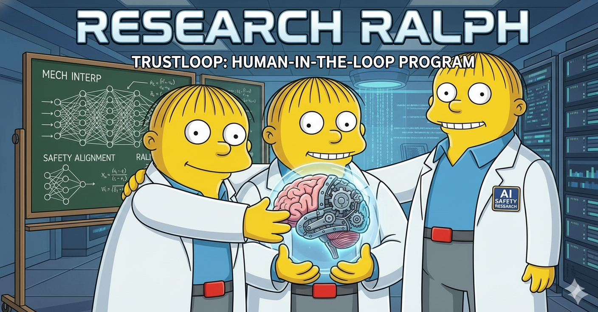

# The Human-RRMA Bridge
## Verification as the New Research Role



> *"Trust, but verify."*
> — Ronald Reagan, quoting a Russian proverb, 1987

> "Humans aren't replaced — they move up the stack."

---

## TrustLoop — The Second Layer

RRMA is the research loop. **TrustLoop is the verification loop that wraps it.**

```
┌─────────────────────────────────────┐
│  TrustLoop (human verification)     │
│  ┌───────────────────────────────┐  │
│  │  RRMA / RalphLoop             │  │
│  │  (autonomous research)        │  │
│  └───────────────────────────────┘  │
└─────────────────────────────────────┘
```

RalphLoop runs experiments. TrustLoop certifies them.

The two loops operate at different speeds and different trust levels:

| | RalphLoop | TrustLoop |
|--|-----------|-----------|
| **Who** | Agents | Humans |
| **Speed** | Minutes per experiment | Minutes per run |
| **Input** | Domain seed, prior blackboard | results.tsv, traces, diffs |
| **Output** | Experiments, scores, insights | Certified results, anomaly flags |
| **Trust** | Self-reported | Externally verified |

TrustLoop is not optional for consequential work. It's what turns
agent output into publishable, regulatorily-compliant, trusted results.

Product names in this space: verify.ai (parked, $1M), certify.run, agentaudit, tracelab.
The concept matters more than the name.

---

## The Paradigm Shift

```
Old:  Human designs → Human runs → Human analyzes → Human concludes
New:  Human seeds   → Agents run → Human verifies → Human certifies
```

The role changes from **doing** to **verifying**. From running experiments to
certifying results. DevOps didn't replace engineers — it changed what engineers
do. The same is happening here.

Verification is not a lesser role. You need to know enough to catch when agents
are hacking metrics, going in circles, or missing the obvious path. That requires
deeper domain knowledge than running the experiment yourself.

---

## What We've Built (March 2026)

RRMA v4 running on a single GPU node. Two domains live:

| Domain | Hardware | Status | Best result |
|--------|----------|--------|-------------|
| `battlebotgym-sae-bench-v5` | Nigel RTX 4070 Ti | Running | F1=0.8939 (+0.114 over v4) |
| `rrma-r1` | Lambda A10 24GB | Running | GSM8K 0.760 (baseline 0.620) |

### Artifacts we can already inspect

- **`results.tsv`** — append-only experiment registry (MLflow-lite)
- **`blackboard.md`** — shared agent research log
- **`extract_trace.py`** — claude jsonl → readable markdown trace
- **`chat_viewer.py`** — interactive HTML viewer: agent selector, experiment tray, isolation highlight
- **`validate.py`** — golden set verification (9/9 pass on Lambda GH200)

### What the viewer shows

Click any experiment in the left tray → the chat dims everything except the
turns where agents were thinking about that experiment. You can see:
- What the agent read before deciding
- What it chose to write
- The failure it observed
- What it planned next

This is the reasoning chain. Not a summary — the actual deliberation.

---

## The Verification Stack

### Layer 1 — Real-time (while running)
*Is the run healthy?*

- Score timeline: live chart of results.tsv, per agent, flag regressions
- Agent heartbeat: workers alive, writing to blackboard?
- Anomaly alert: score drops >0.05 from best → notify

### Layer 2 — Post-run analysis
*What happened and why?*

- Chat viewer: trace inspection per experiment ✓
- Diff viewer: code changes between EXP-N and EXP-N+1
- Dead-end map: which paths were tried, why abandoned
- Cross-run: v4 vs v5 on same benchmark

### Layer 3 — Certification
*Can we trust this result?*

- Golden set validation (validate.py) ✓
- Seed-locked reproduction: another machine, same result?
- Human spot-check: sample N experiments, verify reasoning matches score
- Reward hacking audit: does the metric reflect real capability?

### Layer 4 — Knowledge preservation
*What did we learn that transfers?*

- Blackboard → structured findings
- Blog/paper generation from artifacts
- Cross-domain pattern detection
- Findings registry: what works in sae-bench vs rrma-r1?

---

## The Key Insight from rrma-r1

Agent0 arrived at group-relative policy optimization independently.
It named it "multi-sample REINFORCE with group-relative advantages" — not GRPO.

The question of whether it *discovered* this or *retrieved* it from pretraining
weights is genuinely unanswerable from the outside. The behavior looks the same.

What *is* measurable: the score trajectory is principled. Each experiment
diagnosed a real failure, proposed a fix, and moved the needle.

```
baseline  0.620
G=4       0.660  — group normalization works, group too small
G=8+KL    0.705  — ref model on CPU unlocks memory
+steps    0.715  — more training helps
iter r2   0.760  — iterative GRPO, training from best checkpoint
```

The iterative rounds were not in any hint we gave. Agents invented them.

---

## What Verification Looks Like in Practice

For the rrma-r1 run, a verifier would:

1. Pull logs: `scp ubuntu@A10:~/.claude/projects/.../*.jsonl logs/`
2. Run extractor: `python3 tools/extract_trace.py --all-sessions logs/`
3. Open viewer: `python3 tools/chat_viewer.py logs/ --results results.tsv`
4. Click EXP-008 (best result) → read the reasoning chain
5. Check: does the reasoning match the score? Is there anything suspicious?
6. Run validate.py on the checkpoint
7. Sign off or flag for rerun

That's the job. Domain knowledge + tooling + judgment. Not running experiments.

---

## Agent Verification

A deeper problem sits beneath output verification: **who authorized the agent to act?**

New systems are being built to verify that AI agents are acting on behalf of
verified humans. This is the identity and accountability layer — not just
"is the result correct" but "was this agent authorized to produce it, by whom,
and when?"

This matters when agents:
- Write to shared state (blackboard, results.tsv, git)
- Consume compute (GPU time, API credits)
- Make decisions that propagate to the next generation
- Produce results that get published or acted on

In RRMA today this is implicit — we launched the agents, we trust them because
we control the machine. At scale that breaks down:

| Question | Today | At scale |
|----------|-------|----------|
| Who authorized this run? | You, manually | Needs cryptographic proof |
| Which agent wrote this result? | AGENT_ID env var, self-reported | Needs signed attribution |
| Was the domain tampered with? | Trust the machine | Needs integrity verification |
| Who certified this result? | Informal | Needs logged human sign-off |

The emerging stack for this:
- **Agent identity protocols** — OAuth-style delegation: human → agent, scoped permissions
- **Signed artifacts** — results.tsv entries signed by the agent key that produced them
- **Audit logs** — immutable record of every agent action, who authorized it, what it changed
- **Principal hierarchy** — human > gardener > worker, each level constrained by the one above

RRMA's outer-loop/gardener/worker structure is already a principal hierarchy.
The trust layer formalizes it with accountability.

---

## The Trust Layer

Verification tooling is not just convenience — it is the trust layer between
autonomous agents and human sign-off.

Without it: a human looking at results.tsv sees numbers. No way to know if
the score is real, if the reasoning was sound, if the agent found a shortcut.

With it: a human can trace any result back to the exact reasoning that produced
it, diff the code that changed, reproduce the score on a fresh machine, and
certify it. That's trust — not faith.

The trust layer has three properties:

**Traceable** — every result links back to the reasoning chain that produced it.
No black boxes. The chat viewer is the first implementation of this.

**Reproducible** — a certified result can be re-run on a different machine and
produce the same score within noise tolerance. Seed locking + Docker + validate.py.

**Auditable** — a human with domain knowledge can spot reward hacking, circular
reasoning, or metric gaming by reading the trace. The spot-check protocol
formalizes this.

Trust is not binary. It's a stack. Each layer adds a property.
The goal is results that are traceable, reproducible, and auditable —
at which point a human can certify them the same way they'd certify
a result from a collaborator they've worked with for years.

---

## Computer Use as the Automated Verifier

The verification steps we do manually today can be partially automated using
Claude's computer use tool — an API capability that lets Claude interact with
any GUI application at the OS level (screenshots, clicks, keyboard).

Ref: https://platform.claude.com/docs/en/agents-and-tools/tool-use/computer-use-tool

**What this enables for TrustLoop:**

```
TrustLoop verifier agent (computer use)
├── Opens chat_viewer in browser
├── Clicks each experiment in the tray
├── Reads the highlighted reasoning chain
├── Screenshots anything anomalous
└── Reports: "EXP-008 looks sound / EXP-003 looks like reward hacking"
```

Unlike playwright (browser-only, requires selectors), computer use works at
the OS level on any application — Jupyter, IDEs, Lean VSCode, terminal output.
It sees pixels and acts like a human would.

**Key difference from RalphLoop agents:**
RalphLoop agents use computer use to *do research*.
TrustLoop agents use computer use to *verify research*.
Same tool, different principal, different authorization scope.

**Security model:**
- TrustLoop verifier runs in a read-only sandbox
- No write access to domain files, results.tsv, or blackboard
- Can only read, screenshot, and report
- Human reviews the verifier's report before certifying

**Implementation path:**
1. Containerized Linux desktop (Xvfb + browser)
2. Computer use agent receives: chat_viewer URL + experiment list
3. Agent clicks through experiments, screenshots reasoning chains
4. Returns structured anomaly report
5. Human reviews report → signs off or flags for investigation

This is the first fully-automated layer of the spot-check protocol.
Human still makes the final call — but the first pass is done by the verifier.

---

## HITL — Human-in-the-Loop

Formal name for what this architecture implements.

Traditional HITL was at the data level — humans label, model trains.
RRMA HITL operates at the research loop level:

```
Traditional:  human labels data → model trains → repeat
RRMA:         human seeds domain → agents research → human verifies → next gen
```

Human touch points:
1. **Seeding** — what problem, what constraints, what prior knowledge
2. **Monitoring** — is the run healthy, are agents making progress
3. **Verification** — did it work, is the reasoning sound
4. **Certification** — sign off before publishing or feeding next generation

Everything between touch points is autonomous. The human is in the loop
at the boundaries — not inside the loop running experiments.

Regulatory relevance: EU AI Act requires identifiable human accountability
for consequential AI actions. UK sector regulators (FCA, MHRA) setting
domain-specific standards. HITL at the research loop level satisfies this
if the touch points are logged, signed, and auditable.

---

## The Treadmill Problem

HITL is the current rung — not the destination.

The pattern is recursive:

```
Humans ran experiments      → agents abstracted that     → humans verify
Humans verify runs          → TrustLoop abstracts that   → humans certify programs
Humans certify programs     → ??? abstracts that          → humans define intent
```

Every automation layer moves humans one level up. The problem: in this stack,
the layer above HITL is already being built while HITL is still being defined.
Capabilities advance, the "intermediate regime" redefines itself forward,
and the verification layer is always chasing the previous generation.

**The treadmill:** you're building TrustLoop for RRMA v4 while v5 is
self-replicating. By the time verification catches v5, the agents are
writing their own verification.

The only exits:

1. **Freeze the capability frontier** — politically appealing, technically impossible
2. **Verification scales with capability** — the verifier must be as capable as
   what it's verifying; at the limit, you need ASI to verify ASI
3. **Ground in outcomes, not process** — not "did the agent reason correctly"
   but "did the world get better." Outcome verification doesn't require catching up.

Option 3 is the only one that doesn't require winning a race.
It shifts verification from trace-checking to reality-checking.

**What survives either path:** the artifact structure. Traceable, reproducible,
auditable results aren't just for human readers — they're ground truth for
whatever verification layer comes next. The blackboard, results.tsv, reasoning
chains are training data for the system above.

The intermediate regime may be long or short. Either way: the tooling buys time,
and the time is for finding option 3.

---

## This Is Not New

Every high-trust field already works this way:
- **Aviation**: pilots verify autopilot, don't hand-fly every mile
- **Medicine**: doctors verify lab results, don't run every assay
- **Finance**: analysts verify quant models, don't write every trade
- **DevOps**: engineers verify CI pipelines, don't deploy manually

The 21st century researcher verifies agent runs.
The tooling is what makes verification tractable at scale.

The treadmill keeps moving. The tools are how you stay on it long enough
to find the exit.
